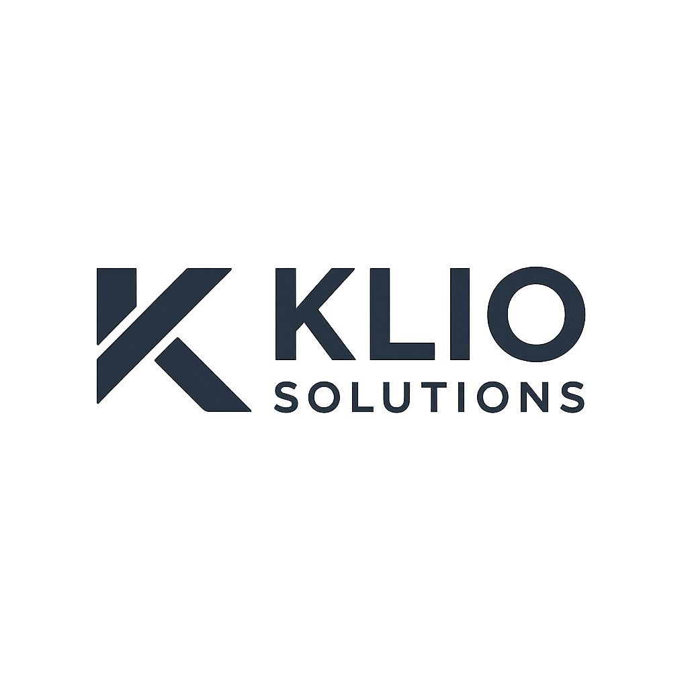

# KLIO Solutions - Professional Software Development Team

**KLIO Solutions** is a dedicated software development team committed to transforming ideas into powerful digital solutions that drive business success. We specialize in creating innovative software solutions for businesses, capstone projects, and custom applications.

##  About KLIO Solutions

KLIO Solutions is a professional software development company based in **Polomolok, South Cotabato, Philippines**. We combine technical excellence with strategic thinking to create software that not only meets your requirements but exceeds your expectations.

### Our Mission
To deliver cutting-edge software solutions that empower businesses and students to achieve their digital transformation goals through innovative technology and exceptional service.

### Our Vision
To be the leading software development partner for businesses and educational institutions, known for our commitment to quality, innovation, and client success.

##  What We Do

### Business Software Development
- **ERP Systems**: Enterprise resource planning solutions
- **CRM Solutions**: Customer relationship management systems
- **Workflow Automation**: Streamline business processes
- **Data Analytics**: Business intelligence and reporting tools

### Academic & Capstone Projects
- **Research & Planning**: Comprehensive project planning and research
- **Technical Implementation**: Full-stack development for academic projects
- **Documentation**: Professional project documentation
- **Presentation Support**: Help with project presentations and demonstrations

### Custom Web Applications
- **Modern Frameworks**: React, Angular, Vue.js applications
- **Progressive Web Apps**: Cross-platform web solutions
- **E-commerce Solutions**: Online stores and marketplaces
- **API Integration**: Third-party service integrations

### Custom Systems
- **System Architecture**: Scalable and maintainable system design
- **Database Design**: Optimized database solutions
- **Integration Services**: Connect existing systems
- **Performance Optimization**: Speed and efficiency improvements

### Mobile Development
- **iOS & Android**: Native mobile applications
- **React Native**: Cross-platform mobile solutions
- **Flutter**: Google's UI toolkit for mobile apps
- **App Store Deployment**: Complete app store submission process

##  Meet Our Team

### Klien John B. Gumapac
**Frontend Developer & UI/UX Specialist**

- **Expertise**: React & UI/UX Design
- **Background**: Graduate from South East Asian Institute of Technology (SEAIT)
- **Location**: Polomolok, South Cotabato, Philippines
- **Skills**: React, TypeScript, Tailwind CSS, Framer Motion, Next.js
- **Specialty**: Creating beautiful, responsive user interfaces that provide exceptional user experiences
- **GitHub**: [@KlienGumapac](https://github.com/KlienGumapac)
- **Email**: Kliengumapac5@gmail.com

*"Design enthusiast who believes great UI can change the world"*

### Keyan Andy Delgado
**Lead Developer & Full-Stack Specialist**

- **Expertise**: Full-Stack Development
- **Background**: Experienced developer with years of industry experience
- **Location**: South Cotabato, Philippines
- **Skills**: React, Node.js, Python, MongoDB, AWS
- **Specialty**: Leading development teams and creating innovative solutions
- **GitHub**: [@St4ckkk](https://github.com/St4ckkk)
- **Portfolio**: [keyanandydelgadodev.vercel.app](https://keyanandydelgadodev.vercel.app)

*"Passionate about creating innovative solutions and leading development teams to success"*

##  Why Choose KLIO Solutions?

###  **Expertise & Experience**
- Years of combined experience in modern technologies
- Proven track record of successful project deliveries
- Continuous learning and adaptation to new technologies

###  **Quality & Innovation**
- Every line of code crafted with precision
- Following industry best practices and standards
- Cutting-edge technologies and creative solutions

###  **Client-Focused Approach**
- Free consultation and project planning
- Transparent pricing and timelines
- Ongoing support and maintenance
- Long-term partnership mindset

###  **Local & Global Reach**
- Based in the Philippines with global capabilities
- Understanding of local business needs
- International standards and practices

### Frontend Technologies
- React, Angular, Vue.js
- TypeScript, JavaScript
- Tailwind CSS, SCSS
- Framer Motion, Next.js

### Backend Technologies
- Node.js, Python
- MongoDB, PostgreSQL
- GraphQL, REST APIs
- Express.js, Django

### Mobile Development
- React Native, Flutter
- iOS, Android
- Firebase, AWS

##  Get In Touch

Ready to transform your ideas into reality? We'd love to hear about your project and discuss how KLIO Solutions can help you achieve your goals.

### Contact Information
- **Phone**: +63 916 333 1597
- **Email**: hello@kliosolutions.com
- **Location**: Polomolok, South Cotabato, Philippines
- **Business Hours**: Monday - Friday, 8:00 AM - 5:00 PM

### What You Get
-  Free consultation and project planning
-  Transparent pricing and timelines
-  Ongoing support and maintenance
-  Modern technologies and best practices

##  Our Website

Visit our professional website to learn more about our services, view our portfolio, and get in touch with our team.

**Website**: [KLIO Solutions](https://klien-gumapac.github.io/klio-website/)

---

**KLIO Solutions** - *Transforming Ideas into Digital Reality*

*Built with  by the KLIO Solutions Team*
